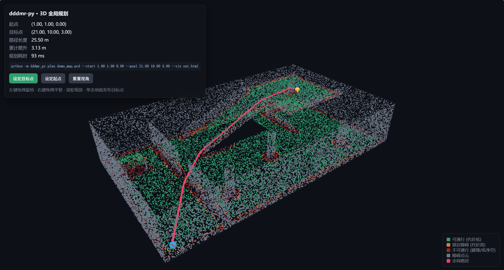
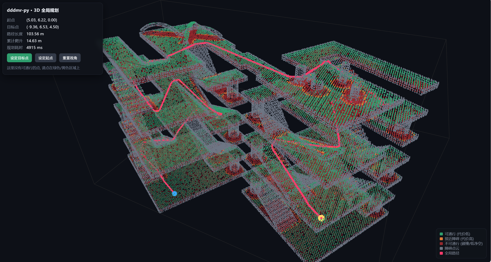
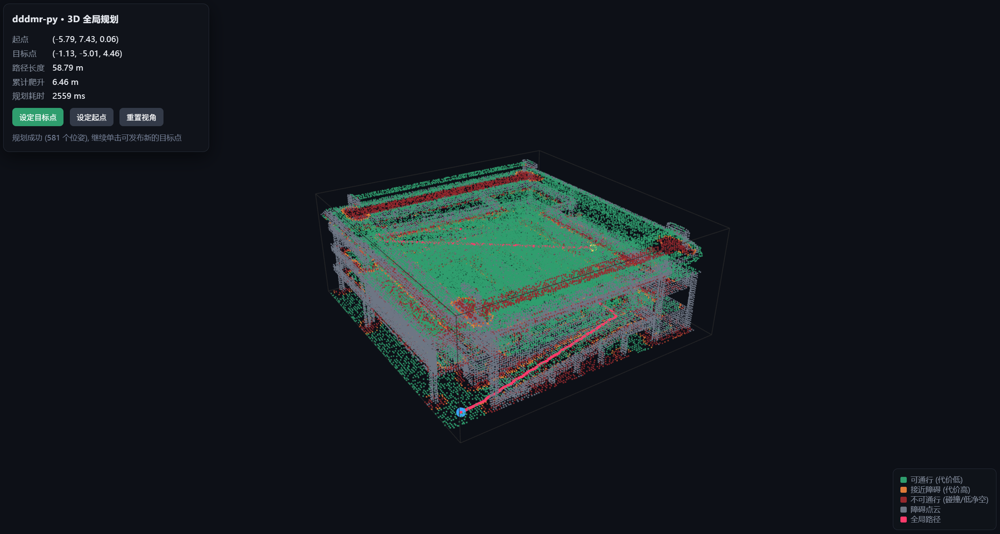
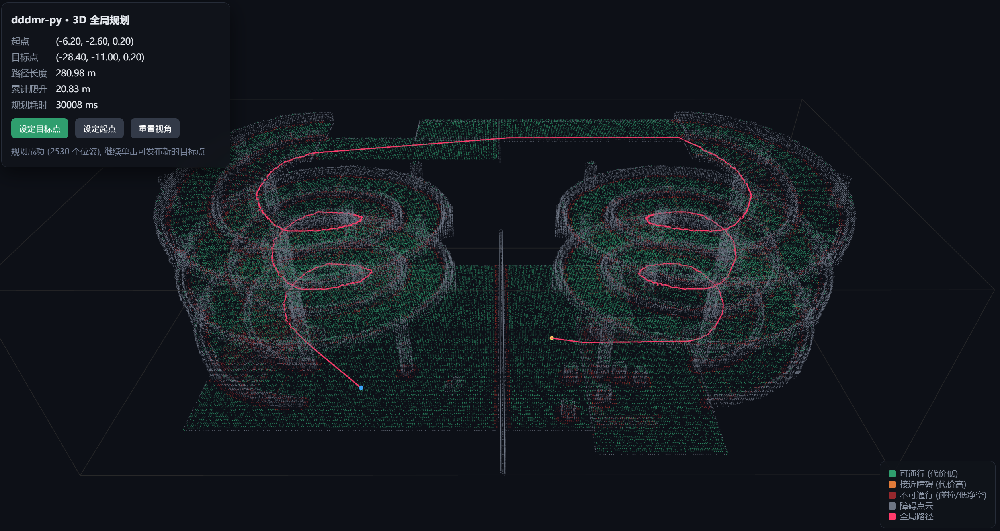

# dddmr_py · Fast 3D 全局规划器

从 **PCD 点云地图**构建 3D 可通行图，并规划到任意 3D 目标点的全局路径。项目不依赖 ROS；可使用命令行、Python API 或浏览器交互服务。

当前默认实现为 **Fast v2**：针对大规模点云优化了建图、内存占用和 A* 搜索，并默认阻止穿过障碍物的图边。

<!-- MAINTAINER_EDITABLE_START: 在 GitHub 网页编辑 README 时，可直接替换下方公告内容。 -->

> **维护者公告（可在线修改）**
>
> 在这里填写版本发布说明、实验室消息、论文链接、视频链接或项目状态。删除本提示后直接写正文即可。

<!-- MAINTAINER_EDITABLE_END -->

## 演示

<p align="center">
  
</p>

<p align="center">
  
</p>

<p align="center">
  
</p>

<p align="center">
  
</p>

<!-- MAINTAINER_EDITABLE_DEMO_START: 可在此处增加视频、GIF、论文图或新的  标签。 -->

<!-- MAINTAINER_EDITABLE_DEMO_END -->

## Fast v2 的改进

| 模块 | Fast 版本做法 | 效果 |
|---|---|---|
| 建图 | 直接 kNN 建图，避免先枚举全部半径内点对 | 大图显著降低时间和内存 |
| 感知 | 分层、分块的定长近邻归约 | 避免 Python 邻居列表导致内存耗尽 |
| 搜索 | `numba` JIT / Python / Scipy 自动降级 | 有 `numba` 时 A* 更快 |
| 缓存 | `.dddmr_cache` 保存预处理图 | 重复使用同一地图可快速启动 |
| 安全 | 默认检查边中部碰撞 | 不再允许路径从墙体中穿过 |
| 不可达目标 | 连通分量预判 | 无需搜索完整张图即可失败返回 |

完整的基准、实现细节和兼容性验证见 [优化报告](dddmr_py/OPTIMIZATION_REPORT.md)；版本变更见 [更新说明](CHANGELOG.md)。

## 快速开始

环境要求：Python 3.9 或更高。

```bash
git clone https://github.com/xiaoqi371317/dddmr_python_3d_global_planner.git
cd dddmr_python_3d_global_planner/dddmr_py
python -m pip install -e ".[fast]"
```

`numba` 是 Fast 搜索后端的可选依赖。无法安装时项目仍可运行，并自动使用优化后的非 JIT 后端。

用内置演示地图验证安装：

```bash
python -m dddmr_py plan demo --start 1 1 0 --goal 21 10 3 \
  --out demo_path.csv --viz demo_path.html
```

成功后会生成 CSV 路径和可在浏览器打开的 HTML 可视化。

## 使用 `luoxuan.pcd`

仓库包含新增的螺旋场景地图 `luoxuan.pcd`（231,885 个原始点）。先查看地图统计：

```bash
python -m dddmr_py info ../luoxuan.pcd --viz luoxuan.html \
  --cache-dir .dddmr_cache
```

启动交互式服务：

```bash
python -m dddmr_py serve ../luoxuan.pcd --start 0 0 0 \
  --port 8000 --cache-dir .dddmr_cache
```

在浏览器打开 <http://localhost:8000>，即可旋转点云、缩放视角，并单击可通行区域发布目标点。`0.0.0.0` 仅表示监听所有网卡；本机浏览器应使用 `localhost` 或 `127.0.0.1`。

## 三种使用方式

### 命令行：离线规划

```bash
python -m dddmr_py plan ../your_map.pcd \
  --start 0 0 0 --goal 12 3 3 \
  --out path.csv --json path.json --viz path.html \
  --cache-dir .dddmr_cache
```

### Python API

```python
from dddmr_py import GlobalPlanner3D, PlannerConfig

config = PlannerConfig(
    robot_radius=0.35,
    robot_height=1.20,
    voxel_size=0.10,
    max_neighbors=18,
    cache_dir=".dddmr_cache",
)
planner = GlobalPlanner3D.from_pcd("map.pcd", config, verbose=True)
path = planner.make_plan(start=(0, 0, 0), goal=(12, 3, 3))

if path.success:
    path.to_csv("path.csv")
    print(path.length, path.climb, path.poses)
else:
    print(path.message)
```

### 浏览器交互服务

```bash
python -m dddmr_py serve ../your_map.pcd --start 0 0 0 \
  --port 8000 --cache-dir .dddmr_cache
```

也可在另一个终端发布目标点：

```bash
python -m dddmr_py goal 12 3 3 --port 8000 --out path.csv
```

## 调参与兼容性

| 需求 | 推荐设置 |
|---|---|
| 大地图优先速度和内存 | `--voxel 0.15` 或 `--voxel 0.20` |
| 希望边密度接近旧版 | `--max-neighbors 18` 至 `24` |
| 重复测试多个起终点 | `--cache-dir .dddmr_cache` |
| 迷宫或绕障场景 | `--alt 8` 至 `16` |
| 复刻旧版可达性行为 | `--compat` |

Fast v2 默认启用长边碰撞检查。因此，若旧版路径曾经穿过墙体，新版本会给出更长但安全的路径，或正确报告目标不可达。使用 `--compat`（或 `PlannerConfig.compat()`）可关闭会改变可达性的安全增强，仅用于复现实验或 A/B 对比。

## 输入、输出与范围

- 输入支持 PCD v0.7 的 `ascii`、`binary` 和 `binary_compressed` 格式；坐标系须为 **z 轴向上**。
- 输出路径为 `[x, y, z, yaw]`，支持 CSV、JSON、Python 数组和 HTTP JSON 响应。
- 本项目处理静态地图上的 3D 全局规划；不含实时建图、定位、动态避障或底盘运动学控制。

## 项目结构

```text
dddmr_py/
  dddmr_py/                  # 规划器实现
    fastops.py               # Fast 数值内核
    cache.py                 # 预处理缓存
    perception.py            # 可通行面与代价层
    graph.py                 # 安全 kNN 图构建
    search.py                # A* / 双向 A* / ALT
  tests/                     # 单元测试
  OPTIMIZATION_REPORT.md     # 性能与等价性报告
luoxuan.pcd                  # 螺旋场景示例地图
assets/                      # README 演示图片
```

## 自检

```bash
cd dddmr_py
python tests/test_planner.py
```

<!-- MAINTAINER_EDITABLE_CONTACT_START: 可在 GitHub 网页编辑此处，填写作者、单位、引用方式、许可证或联系方式。 -->

## 维护者信息（可在线修改）

- 作者/团队：待补充
- 单位/实验室：待补充
- 论文或项目主页：待补充
- 许可证与引用方式：待补充

<!-- MAINTAINER_EDITABLE_CONTACT_END -->

## 致谢

本项目参考 [dddmr_navigation](https://github.com/dfl-rlab/dddmr_navigation) 中感知静态层和全局规划器的算法思路，并以纯 Python 方式实现和扩展。
